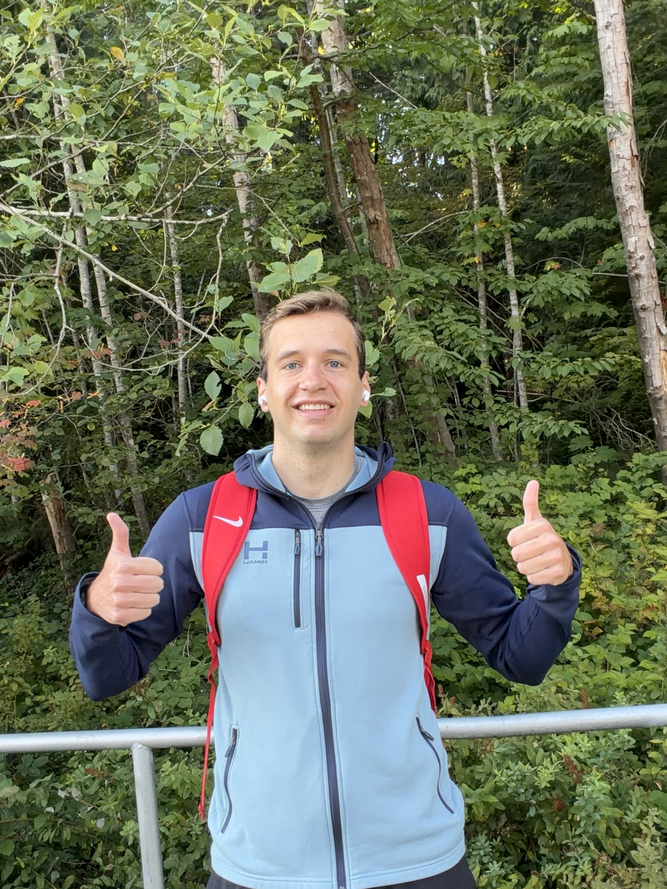

My first few weeks here have been a lot of fun but also difficult at times as I've moved to a new country. Understanding how certain things work here in Vancouver when compared to things in Minnesota has been fun and interesting to experience. Especially since I drove my own car here, there are lots of new things to experience. Bike lanes are not as popular in Minnesota as here in Vancouver, so I've had to make sure everytime I turn onto a new street I don't hit a bicyclist riding by. Other than that I've done plenty of hikes and experienced all throughout Squamish and Whistler which has been a blast.